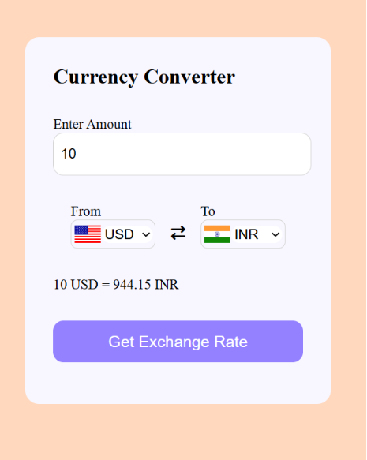

# 💱 Currency Converter

A simple and responsive Currency Converter built with **HTML, CSS, and JavaScript**. This project uses the Fetch API to retrieve real-time exchange rates and dynamically convert between different currencies.

## 🚀 Features

* 🌍 Convert between multiple currencies
* 📈 Real-time exchange rates using Currency API
* 🚩 Automatic country flags for selected currencies
* 🔄 Dynamic exchange rate updates
* 💻 Clean and responsive user interface
* ⚡ Built with Vanilla JavaScript and Fetch API

## 🛠️ Technologies Used

* HTML5
* CSS3
* JavaScript (ES6)
* Fetch API
* Currency API by Fawaz Ahmed
* FlagsAPI

## 📸 Preview



## ⚙️ How It Works

1. Select the source currency.
2. Select the target currency.
3. Enter the amount.
4. Click **Get Exchange Rate**.
5. The application fetches live exchange rates and displays the converted amount.

## APIs Used

### Currency API

```
https://github.com/fawazahmed0/exchange-api
```

### Country Flags API

```
https://flagsapi.com/
```

## Learning Objectives

This project helped me practice:

* JavaScript DOM Manipulation
* Event Handling
* Async/Await
* Fetch API
* JSON Data Handling
* Dynamic UI Updates
* Working with External APIs

## Inspiration and References

This project was built as a practice exercise while learning **JavaScript Fetch API, Promises, and Async/Await**. The implementation was inspired by the following resources:

* [🎥 **JavaScript Fetch API Project by Shradha Khapra**]
  (https://www.youtube.com/watch?v=CyGodpqcid4&list=PLfqMhTWNBTe0PY9xunOzsP5kmYIz2Hu7i&index=17)

* [💻 **Inspired Currency Converter GitHub Repository**]
  (https://github.com/shradha-khapra/JavaScriptSeries/tree/main/CurrencyConverter)

While following these resources, I rebuilt the project independently and adapted it to work with updated APIs, dynamic country flags, and improved functionality to strengthen my understanding of JavaScript and API integration.


## Getting Started

Clone the repository:

```bash
git clone https://github.com/bhagyashah-dev/Currency-Converter.git
```

Open `index.html` in your browser.

## Future Improvements

* Swap currency button functionality
* Searchable dropdowns
* Error handling and loading states
* Dark mode
* Currency charts and history
* Favorite currencies

## Author

**Bhagya Shah**

* GitHub: https://github.com/bhagyashah-dev
* LinkedIn: https://linkedin.com/in/bhagyashah

---

⭐ If you found this project interesting, consider giving it a star!
